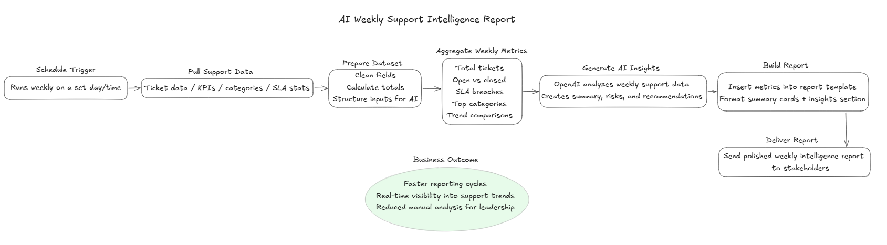
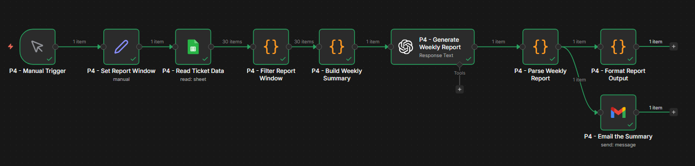
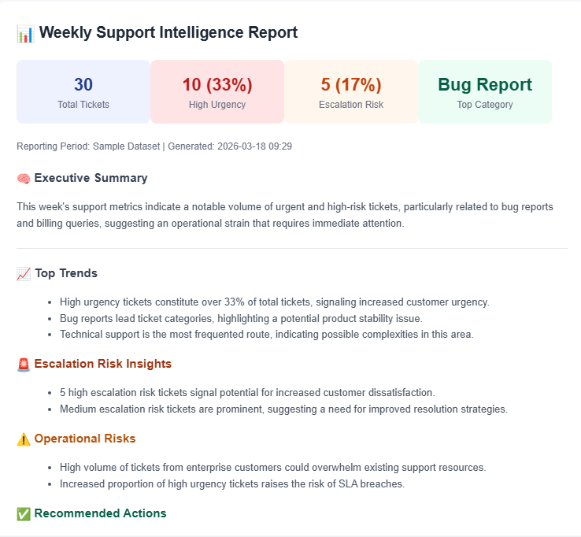

# AI Weekly Support Intelligence Report

AI-powered reporting workflow built with **n8n** and **OpenAI** to automatically generate structured weekly support insights and deliver them to stakeholders.

---

## Overview

Most support teams rely on manual reporting, spreadsheets, and ad hoc analysis to understand performance trends — which is time-consuming and often delayed.  

This project automates the creation of a **Weekly Support Intelligence Report**, combining structured metrics with AI-generated insights to provide a clear, executive-ready summary of support performance.

This is **Project 4** in a broader system:

- Project 1 → AI Ticket Triage  
- Project 2 → Escalation Risk Detection  
- Project 3 → SLA Breach Prediction  
- Project 4 → Weekly Support Intelligence Report *(this project)*  

---

## Architecture

This workflow represents the reporting and insights layer of a multi-stage AI-powered support operations pipeline, transforming raw ticket data and AI signals into actionable intelligence.

---

## AI Support Automation Series

This project is part of a multi-stage AI-powered support operations system designed to move teams from reactive workflows to proactive, intelligence-driven operations.

Each project builds on the previous one:

### 🔹 Project 1: AI Ticket Triage  
Classifies incoming support tickets, enriches them with structured metadata, and establishes a clean foundation for downstream automation.  
👉 https://github.com/jesseautomates/ai-support-ticket-triage-automation

---

### 🔹 Project 2: Escalation Risk Detection  
Identifies tickets likely to escalate by analyzing urgency, sentiment, and response patterns, enabling earlier intervention.  
👉 https://github.com/jesseautomates/ai-support-escalation-risk-detection

---

### 🔹 Project 3: SLA Breach Prediction  
Predicts which tickets are at risk of missing SLA before deadlines are breached, allowing teams to prioritize and act proactively.  
👉 https://github.com/jesseautomates/ai-support-sla-breach-prediction *(update if needed)*

---

### 🔹 Project 4: Weekly Support Intelligence Report *(this project)*  
Aggregates support metrics and AI signals into a structured weekly report with insights, risks, and recommendations.

---

Together, these projects form a layered AI pipeline:

**Triage → Risk Detection → SLA Prediction → Intelligence Reporting**

This progression demonstrates how AI can be applied incrementally to transform support operations at scale.

---

## What this workflow does

- Ingests weekly support data (tickets, SLA metrics, categories)
- Aggregates key performance indicators
- Leverages AI to generate:
  - Summary insights
  - Risk indicators
  - Recommendations
- Formats results into a clean HTML report
- Sends a polished weekly report to stakeholders
- Enables consistent, automated reporting

---

## How it works

### 1. Data Intake & Preparation
- Receives support data (API, CSV, database)
- Cleans and standardizes fields
- Calculates base metrics:
  - Total tickets
  - Open vs closed
  - SLA breaches
  - Category distribution

---

### 2. Metric Aggregation
- Aggregates weekly performance data
- Identifies:
  - Volume trends
  - Top issue categories
  - SLA performance patterns
- Structures inputs for AI analysis

---

### 3. AI Insight Generation
- OpenAI analyzes aggregated support data
- Generates:
  - Executive summary
  - Key risks
  - Actionable recommendations

- Interprets trends such as:
  - Rising ticket volume
  - SLA degradation
  - Category spikes

---

### 4. Report Generation
- Builds structured HTML report
- Includes:
  - KPI summary cards
  - Trend highlights
  - AI-generated insights section
- Formats for readability and stakeholder consumption

---

### 5. Delivery Layer
- Sends report via email to stakeholders
- Can be extended to:
  - Slack
  - Dashboards
  - Internal tools

---

### 6. Fallback & Validation Logic
- Validates input data before processing
- Handles missing or null values
- Provides fallback reporting if AI generation fails

---

## Example Output

### Sample Metrics

| Metric | Value |
|-------|------|
| Total Tickets | 124 |
| SLA Breaches | 8 |
| Top Category | Login Issues |

## Screenshots

### Workflow Overview

### Sample Report Output

---

### AI Summary Example

- Ticket volume increased 12% week-over-week  
- SLA breaches concentrated in Tier 1 queue  
- Spike in login-related issues  

---

### Recommendations

- Increase Tier 1 coverage during peak hours  
- Investigate root cause of login issues  
- Monitor SLA risk trends more closely  

---

## Tech Stack

- **n8n** (workflow orchestration)
- **OpenAI API** (AI-generated insights)
- HTML templating (report formatting)
- Optional integrations:
  - Google Sheets
  - Email / Slack
  - Help desk platforms

---

## Setup

1. Import the workflow JSON into n8n  
2. Add API credentials (OpenAI, etc.)  
3. Configure your data source (CSV, API, database)  
4. Customize report template if needed  
5. Set schedule trigger (weekly)  
6. Run test data through the workflow  
7. Tune prompts and output formatting  

---
